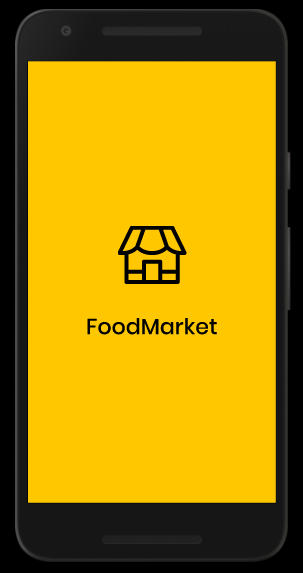
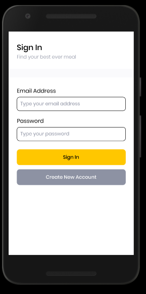
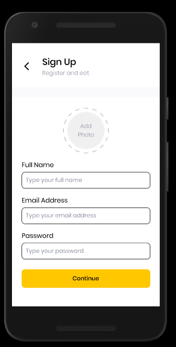
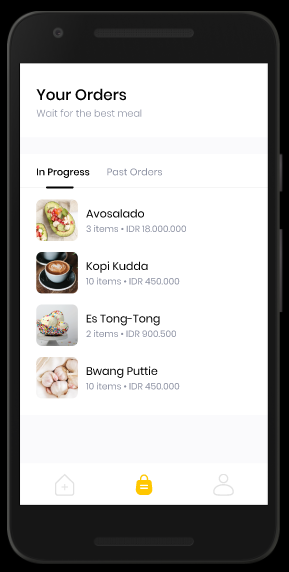
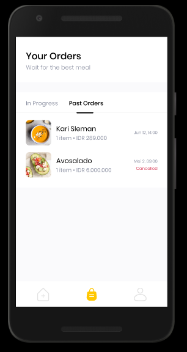
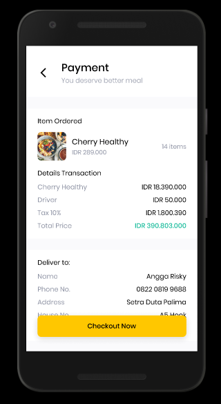
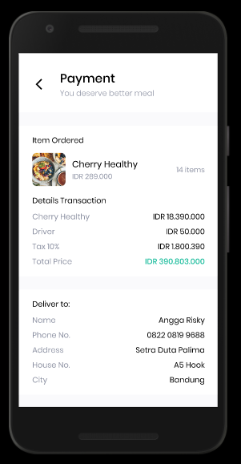

# Food-Market-Code
 Make food market apps using react-native framework
  
 **Screenshot**
 
  
  
  
 
 
 SplashScreen 

 

 Login 

 

 SignUp 

 

 Home 

 

 Bags 

 

 Our Order 

 

 Our Profile 

 

 Checkout  

 

 Payment 

## Running your React Native application
### Step 1: Start Metro
First, you will need to start Metro, the JavaScript bundler that ships with React Native. Metro "takes in an entry file and various options, and returns a single JavaScript file that includes all your code and its dependencies."—Metro Docs

To start Metro, run npx react-native start inside your React Native project folder:

**npx react-native start
**react-native start starts Metro Bundler.

If you use the Yarn package manager, you can use yarn instead of npx when running React Native commands inside an existing project.

If you're familiar with web development, Metro is a lot like webpack—for React Native apps. Unlike Kotlin or Java, JavaScript isn't compiled—and neither is React Native. Bundling isn't the same as compiling, but it can help improve startup performance and translate some platform-specific JavaScript into more JavaScript.

## Step 2: Start your application
Let Metro Bundler run in its own terminal. Open a new terminal inside your React Native project folder. Run the following:

**npx react-native run-android**
If everything is set up correctly, you should see your new app running in your Android emulator shortly.
